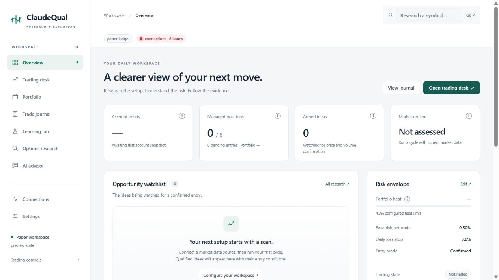

# ClaudeQual

**An autonomous momentum trading and research workspace, with Interactive Brokers as the first deployment target.**

The system scans its equity universe, researches unusual options activity, finds setups, applies portfolio limits, sizes entries, manages exits, reconciles executions, tracks missed setups and runs improvement experiments. Humans and maintenance agents can inspect the same state through the dashboard, CLI and API.

This rebuild follows the [whole-program review](docs/REVIEW.md) of [Claude_Qual](https://github.com/phelo1/Claude_Qual). Version 0.3 extends the initial redesign with an autonomous controller, fitted outcome-model weights, prospective challenger accounts, automatic promotion/canary/rollback, durable execution tracking and operational supervision.



## Start with IBKR paper trading

Python 3.11+ and a local TWS / IB Gateway installation are required for IBKR execution.

```bash
git clone https://github.com/phelo1/ClaudeQualopen.git
cd ClaudeQualopen
python -m venv .venv
# Windows PowerShell: .venv\Scripts\Activate.ps1
# macOS/Linux: source .venv/bin/activate
python -m pip install -e ".[dev,ibkr]"
qmag dashboard --data csv --state-dir ibkr_paper --port 8765
```

Open [the dashboard](http://127.0.0.1:8765), configure connections and strategy settings, and stop this setup-only dashboard before starting the supervisor. Select the connected IBKR paper account in `IBKR_ACCOUNT` when more than one account is exposed; paper mode checks the DU account prefix. Use TWS paper port 7497 or Gateway paper port 4002, with API access enabled. No credentials or market observations are bundled.

```bash
qmag autopilot --broker ibkr --data ibkr --state-dir ibkr_paper --port 8765
```

`autopilot` supervises the scheduler and local dashboard, restarts crashed processes with backoff and rotates their logs. The scheduler performs scans, options research, execution reconciliation, learning and backups. Put the supervisor under an operating-system service for reboot recovery. The existing deployment files remain available; consult the [operating runbook](docs/AUTOPILOT.md).

Use `--broker paper` for the local simulated ledger, `--broker alpaca` for Alpaca paper, or `--broker mt5` for an MT5 demo terminal on Windows. Install the matching optional extra. Live modes use `ibkr-live`, `alpaca-live` or `mt5-live` and retain explicit live confirmation. Opening a dashboard alone does not start the scheduler.

## What improves automatically

1. Chronological backtests propose bounded changes to selection thresholds, initial stop distance and profit targets. Consumed holdout periods are not reused as fresh evidence.
2. A regularized outcome model fits real coefficients to recorded entry features and resolved trade outcomes. Paper and shadow evidence receive lower training weights; estimated legacy outcomes are excluded.
3. Baseline and challenger run in isolated paper accounts on subsequent observations through the same trading routine. Minimum prospective sample sizes, relative return improvement and drawdown limits govern promotion.
4. A live promotion starts at a reduced risk budget. Verified outcomes with known costs govern completion of the canary stage. Deterioration can automatically restore the previous policy. Deployment drawdown monitoring continues between experiments.

This is **supervised learning plus autonomous strategy optimization**, not an RL agent or a fine-tuned language model. Both settings and learned weights can matter; the [learning design](docs/LEARNING.md) explains the choice, incentives and limitations. No improvement in investment returns has been established by software tests.

## Human and agent interfaces

- **Overview / Trading desk:** account state, qualified setups, checks, decisions and controls.
- **Market monitor:** candles, volume, moving averages, setup region where available, planned/actual entries, stops, targets, execution markers and dollar P&L for monitored names.
- **Learning lab:** research state, active policy, challenger progress, promotion history and journal explanations.
- **Operations:** scheduler health, errors with recovery actions, backups and structured API links.

```bash
qmag operations --state-dir ibkr_paper
qmag housekeeping --state-dir ibkr_paper
qmag daemon --once research --broker paper --state-dir research
qmag replay --intraday-dir data/minute --daily-dir data/daily --config replay.yaml --output experiments/replay-001
python -m pytest -q
```

Read-only agent entry points: `GET /api/operations`, `/api/autonomy`, `/api/monitor`, `/api/report`, and `/openapi.json`. Scoped maintenance actions and authentication are documented in [AUTOPILOT.md](docs/AUTOPILOT.md).

## Boundaries that remain

All three execution adapters implement the common lifecycle, with broker-specific differences documented in [ARCHITECTURE.md](docs/ARCHITECTURE.md). Automated tests use offline fixtures; no real broker account was exercised during this rebuild. IBKR authentication/permissions, broker history retention, unknown fees, corporate actions, real liquidity and data availability still require operational handling. An unknown execution blocks new risk rather than being guessed away.

Daily OHLC bars cannot reconstruct intraday price order. The new intraday replay consumes timestamped bars and next-bar market fills, but still does not recreate an exchange order book. Prospective local paper accounts also use a simplified fill model. The default strategy/universe is US-listed, long equity momentum; options are researched as signals, not executed as multi-leg options strategies. This is not a universal multi-asset trading engine.

## Documentation

- [Original review and coverage](docs/REVIEW.md)
- [Current architecture and broker boundaries](docs/ARCHITECTURE.md)
- [Learning, objectives and evaluation](docs/LEARNING.md)
- [Autopilot and agent maintenance runbook](docs/AUTOPILOT.md)
- [Migration](docs/MIGRATION.md)
- [Verification](docs/VERIFICATION.md)
- [Historical reference](docs/LEGACY_REFERENCE.md), superseded where current behavior differs
