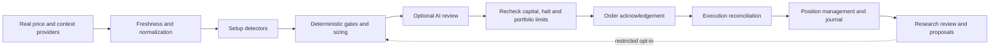

# Architecture and operating boundaries

ClaudeQual is a rules-driven momentum research and execution workspace, not a trained trading model. The original detectors, providers, CLI, broker adapters, options analysis and AI tools remain available. The rebuild changes risk boundaries, research timing, evidence policy and the interface.

| Layer | Main modules | Responsibility |
|---|---|---|
| Inputs | data, universe, fundamentals, context, uw | Real inputs, freshness, coverage and API budgets |
| Rules | setups, indicators, themes, regime, sentiment | Candidate detection and eligibility |
| Decisions | plan, reviewer, llm, rationale | Sizing, gates and optional model opinions |
| Execution | session, trader, broker, halt | Coordination, orders, reconciliation and management |
| Persistence | persistence, health, accounts | Atomic replacement and local writer coordination |
| Research | backtest, optimize, learning, insider | Explicit simulations and observational comparisons |
| Interface | dashboard, templates, static | Overview, desk, portfolio, journal, learning and configuration |

## State and execution

Mutating session operations use a reentrant thread/process lease per state directory. Cached paper ledgers refresh at entry. State replacement uses unique temporary files, flush/fsync and `os.replace`. Received order acknowledgements are checkpointed before fill waits or protection. Emergency halts persist before waiting for the writer or contacting a broker; submissions recheck the flag.

These are **single-machine, local-disk** guarantees. Do not share writable state between hosts or put it on a network filesystem. JSON files and the broker API are not one transaction. A timeout can mean an order was accepted without returning an acknowledgement: inspect the broker before retrying.

A plan is not an order, and an acknowledgement is not a fill. An unconfirmed exit stays tracked with `pending_exit`; unresolved exits block more portfolio risk. An externally cancelled/rejected exit may need operator reconciliation. The current adapter contract cannot reconstruct every execution event.

Journal evidence distinguishes `paper_fill`, `broker_verified` and `estimated`. Legacy records default to estimated. Verified describes observed price/quantity, **not** certification of all commissions, financing, currency conversion or fees. An inferred partial sale downgrades the resulting record. Bar-inferred closures remain visible but cannot authorize automatic adjustments.

Material live boundaries remain: partial entry fills, asynchronous bracket replacement, inferred broker stop/target prices and symbol-wide cancellation. Use a dedicated account/desk and validate the broker's paper environment first. The redesign does not certify unattended live operation.

## Research assumptions

Backtests now execute completed-bar signals at the next available session's open, with costs and a gap limit. `execution_model="legacy_intrabar"` retains the original same-bar assumption for explicitly labelled comparisons. It is not evidence of executable performance.

The engines share sizing, heat/theme constraints and early failed-breakout behavior, but daily research does not replay intraday volume confirmation, live AI/context, the intraday daily-loss latch, latency or queue priority. Stop/target ordering and closing-price exits remain daily-bar assumptions. Final open positions are marked, not forcibly closed. Walk-forward folds reset positions; the stitched curve represents independent experiments, not an uninterrupted account.

## Security

Public binds require a dashboard password. Cross-origin browser mutations are refused; authenticated bearer API clients remain supported. Forwarded identity/scheme headers must be resolved by Uvicorn's trusted-proxy configuration. Browser-supplied forwarding headers are not trusted by the application. Pages prevent framing and account-data caching. POSIX private files retain mode 0600; Windows installations need appropriate NTFS directory ACLs.

AI outputs remain inside deterministic halt, sizing and portfolio controls. Enabling a model neither trains its weights nor establishes a statistical trading edge.
